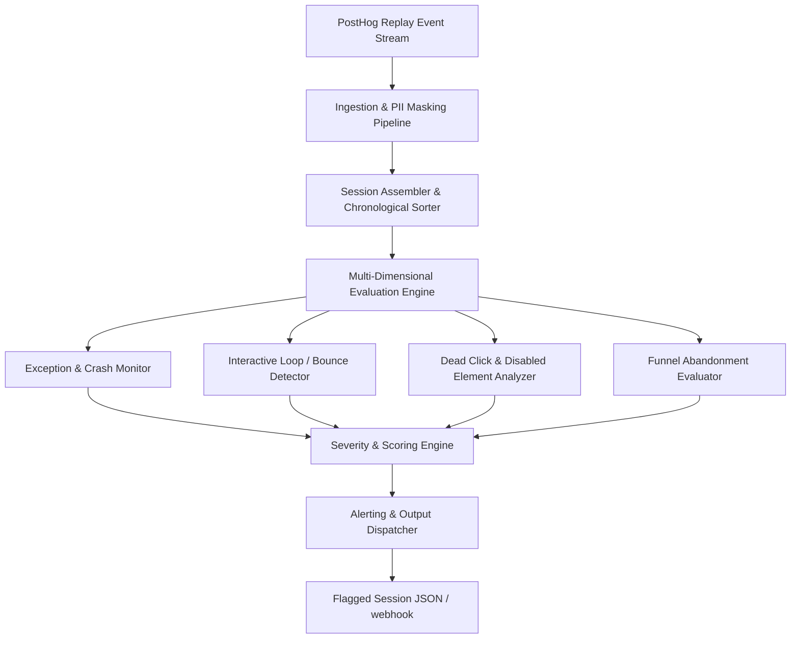

# PLAN.md — PostHog UX Bug Detection System

This document outlines the architectural plan for automatically detecting, classifying, and flagging UX bugs in **AgentCollect** from PostHog session replay event streams before users report them.

---

## 1. Architecture

We will ingest raw PostHog event traces structured as ordered lists of events per session (including `$pageview`, `$autocapture`, `$exception`, `$rageclick`, `$dead_click`, and `$pageleave`).

### Components and Data Flow

1. **Ingestion & PII Scrubbing Pipeline (Server-side):**
   Prior to entering any evaluation processing, events undergo an active sanitization step. All text values, input parameters, and attributes that could contain PII are stripped or hashed.

2. **Session Assembler:**
   Groups incoming events by `session_id` and ensures they are sorted chronologically by relative timestamp `t`.

3. **Multi-Dimensional Evaluation Engine:**
   We run every session through 4 parallel rule detectors to flag anomalies:
   * **Exception Monitor:** Inspects `$exception` events. Distinguishes between handled errors (e.g. invalid inputs) and unhandled crashes.
   * **Navigation Bounce Detector:** Identifies loops where a user navigates between a set of pages in short intervals (e.g., repeatedly going to a page and exiting because it fails to load or shows a 404/500).
   * **Interactive Dead-Click Tracker:** Looks for high-density click behavior that yields no state transition, URL navigation, or successful AJAX completion. Specifically scans for clicks on elements containing `disabled: true` state attributes.
   * **Funnel Abandonment Evaluator:** Analyzes funnel-specific completion markers. Uses persona-specific maps to detect if a debtor scrolled to the end of a form, spent significant duration filling out inputs, but exited without triggering the success page event.

4. **Severity & Scoring Engine:**
   Combines active alerts to produce a normalized severity score (0.0 to 1.0).
   $$\text{Severity} = \min(1.0, \sum (w_i \times \text{Signal}_i))$$
   * *Critical (0.9 - 1.0)*: Page fails with $404/500$ status code; unhandled script exceptions during form submissions.
   * *High (0.6 - 0.8)*: Rage clicking on core action elements (e.g., "Confirm payment", "Submit dispute"); disabled submission buttons combined with high text-entry activity followed by early exit.
   * *Medium (0.3 - 0.5)*: Repeated clicks on navigation items that show no changes; dead clicks on optional links ("Need help?").
   * *Low (0.0 - 0.2)*: Standard session navigation, healthy checkouts, or handled validation messages.

---

## 2. Generalization & Expected Behavior

To catch bugs we have *never seen*, we do not use hardcoded element selectors or static lists of known bugs. Instead, we define **expected behavioral invariants** and verify them against actual traces.

### How We Judge "Broken" (Expected vs. Actual)
Expected behavior differs fundamentally based on user Persona:

1. **Debtor Pages (Strict Linear Funnel):**
   * **Expected Path:** `/pay` $\rightarrow$ `/checkout` $\rightarrow$ `/success` OR `/dispute` $\rightarrow$ `/submitted`.
   * **Ground Truth:** A database map of required steps for a transaction to succeed.
   * **Broken Signature:** 
     * *Funnel Abandonment*: A user reaches `/checkout` or `/dispute`, spends $>10$ seconds interacting (e.g., scroll depth 100%, text entries), clicks "Submit/Pay", but the session terminates with `converted: false` and no succeeding page view.
     * *State Deadlocks*: A user is on a submission step, but the submit button has `disabled: true` despite all input areas being focused or filled, triggering rage clicks.

2. **Client Dashboard (Non-Linear Task Execution):**
   * **Expected Path:** Exploration of multiple modules `/dashboard`, `/reports`, `/cases`, `/imports`.
   * **Ground Truth:** OpenAPI specs for routing status codes and application state validation rules.
   * **Broken Signature:**
     * *Broken Navigation*: A page load event returning `status: 404` or `status: 500`, followed by immediate redirection or navigation loops.
     * *Process Stall*: Triggering a "Process" or "Export" action, followed by an exception event or long idle periods with zero success/status updates, ending in page abandonment.

---

## 3. Privacy & Compliance (PII)

Because debtor sessions contain sensitive B2B debt details and personal identifiers, privacy compliance is a top priority:

* **Client-Side Masking (PostHog level):** 
  Enforce strict PostHog recording rules: use `ph-no-capture` CSS classes on all form inputs and mask all text variables. Ensure no passwords, card details, balances, or debtor names are recorded in event attributes.
* **Server-Side Scrubbing:** 
  The ingestion layer will actively redact any values containing emails, names, phone numbers, or credit card regex patterns from elements' `text` or `attrs` fields.
* **Zero Third-Party LLM Traces:** 
  We will **not** send raw event arrays or HTML content to external LLMs. Analysis is performed using deterministic local code and rule engines.
* **Short Retention Window:** 
  Store raw event logs for a maximum of 14 days. Retain only aggregated metadata and flagged session statistics (e.g., timestamp, session ID, trigger signal, severity) for long-term trends.

---

## 4. Clarifying Questions

1. **What is the exact schema and masking level of the `$autocapture` element attributes in production?**
   * *Why it matters:* To accurately determine if a submit button is disabled or if a drop-down menu is stuck, we need to inspect `attrs` and `text`. If production uses complete text masking, we must rely entirely on element tags and click patterns.
   * *Default Assumption:* Element tag names (e.g. `button`, `textarea`) and generic state attributes (`disabled`, `href`, `status`) are captured, but user inputs and custom text are fully masked.
   * *What changes:* If custom text is available, we can parse exact error messages from DOM text nodes to pinpoint specific validation failures.

2. **Are there custom telemetry events pushed during backend request failures (e.g., Stripe network issues)?**
   * *Why it matters:* If the frontend silently fails because an API request failed, but no JS `$exception` is thrown, we must look for specific fetch/XHR event failures in the telemetry.
   * *Default Assumption:* We only have default PostHog auto-captured events (`$pageview`, `$autocapture`, `$rageclick`, `$exception`, `$dead_click`).
   * *What changes:* If network event tracking is available, we can correlate dead clicks with underlying `5xx` or failed XHR responses directly.

3. **How should false positives (e.g., users clicking a disabled button intentionally before finishing a form) be handled?**
   * *Why it matters:* If we flag every session where someone clicks a greyed-out button once, we will flood the dashboard.
   * *Default Assumption:* We require a threshold (e.g., click count $\ge 3$ or a subsequent exit event) before raising severity to Medium or High.
   * *What changes:* We can optimize the threshold dynamically based on persona types or introduce a feedback loop where engineers mark flags as "false alarm" to retrain threshold limits.
